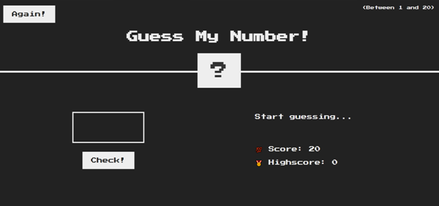
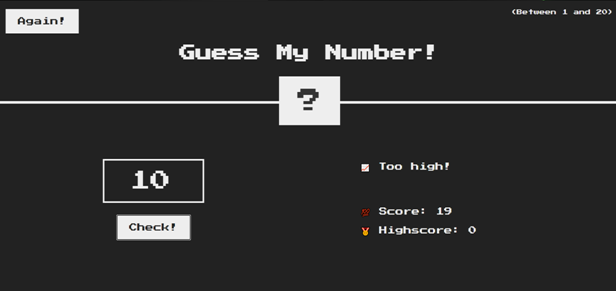
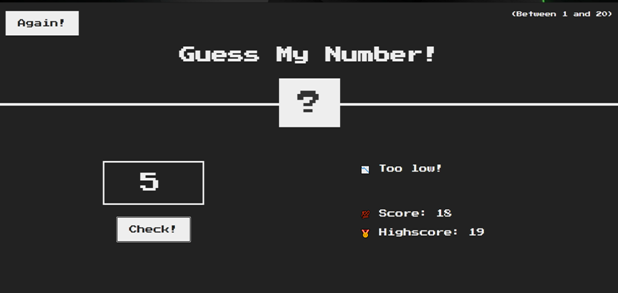
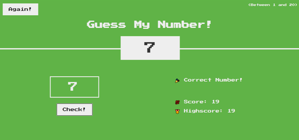
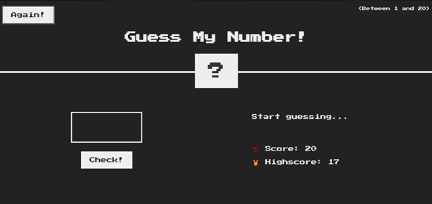
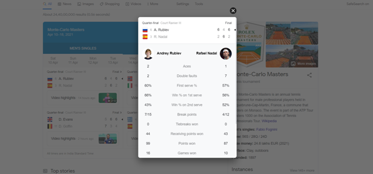

# Project1 - [Mapty App](/Mapty/)

This application can be used to create a workout schedule by placing markers on the map and setting a description over it

**Map functionality is implemented using Geo-location API**

## User Interface

## Architecture

## Flowchart

# Project2 - [Guess my number game](/NumberGame/)

Here I have developed a web game where the user is required to guess a randomly generated number (hidden in ?) between 1 and 20 in 20 guesses

## User Interface

## Working
1. User enters a number in the box
2. Then clicks on the check button
3. Score= 20 - no. of guesses 
4. Again button restarts the game from 0

## Making guesses
Upon clicking the 'check' button an appropriate message is flashed based on how close the guess is to the number

### Guess> Number

### Guess < Number

### Correct guess

## Again button

**Screenshot taken at different time. The highscore does not show a bug**

# Project3 - [Modal window](https://singhdivyank.github.io/modal_window/)

Here I have implemented a modal window. Now what is a modal window?

The screenshot attached below can be considered a close real world example to my idea of a modal window:

The features implemented by such a window are:

1. The window appears on click
2. Closes on clicking the 'X', pressing the escape key or clicking anywhere in the overlay (area outside the window)

The code can be found [here](https://github.com/singhdivyank/modal_window)

# Project4 - [Dice Game](https://github.com/singhdivyank/dice-game)

## User Interface

A very easy game of dice roll between two players taking chances at rolling the dice. A number is obtained on rolling the dice which gets added to the player's score. The first player to reach 100 is the winner

## Algorithm

## Declaring the winner

**However the game is not so simple**. Wondering why? A dice roll of 1 makes this game interesting-
1. On a dice roll of 1, the other player gains control of the dice
2. On a dice roll of 1, the player's instantaneous score gets lost

### Individual components
1. Roll dice- randomly generates a number between 1 and 6
2. Hold- 
    
    a. Adds the players score to current score
    
    b. Sets score to 0
    
    c. Transfers dice control to next player
3. New game- Resets the entire UI and sets score, current score to 0

**Describing the gameplay is difficult. It is advisable to understand the game by [playing](https://singhdivyank.github.io/dice-game/) it**

# Project5 - [Bankist website](https://github.com/singhdivyank/bankist)

An implementation of advanced **Document Object Model (DOM)** features

## Features
1. Smooth scrolling
2. Menu fade
3. Sticky navigation
4. Lazy loading of images
5. Slider

# Project6 - **My first web application**

A modern application that renders Pizza receipes from APIs using Netlify. The application allows users to add receipes, bookmark receipes and search a receipe from a search menu.

## User Interface

1. Receipes are rendered on the left showing the ingridients, their quantity and instructions to prepare the dish
2. A scroll menu appears on the right where the user chooses a particular receipe by clicking on it

## User stories

1. Search for receipes to find new ideas for meals
2. As a user update the number of servings, so that I can cook a meal for different number of people
3. Bookmark receipes to review them later
4. Create own receipes to have them all organized in the same app
5. See bookmarks and own receipes when leaving the app and come back later to close the app safely after cooking

## Features
1. **Search functionality** 
    * An input field sends request to API with searched keywords 
    * Displays receipe with cooking time, servings and ingredients; results with indentation display

2. **Change servings functionality** 
    * Update ingredients according to number of servings

3. **Bookmarking functionality** 
    * Display list of all bookmarked recipes
    * User receipes are automatically bookmarked
    * Store bookmark data in the browser using local storage, on a page load read saved bookmarked data from local storage and display

4. User can upload own recipes and can see only his own recipes (not those from other users)

## Architecture

## Flowchart

## Pre requisites

1. Nodejs
2. Parcel
3. Babel
4. Netlify

**Note**: The above mentioned projects were developed from scratch while learning JavaScript in the [Udemy course](https://www.udemy.com/course/the-complete-javascript-course/) by Jonas Schmedtmann, the orignal idea is retained I have added new functionalities and improved few existing functionalities
